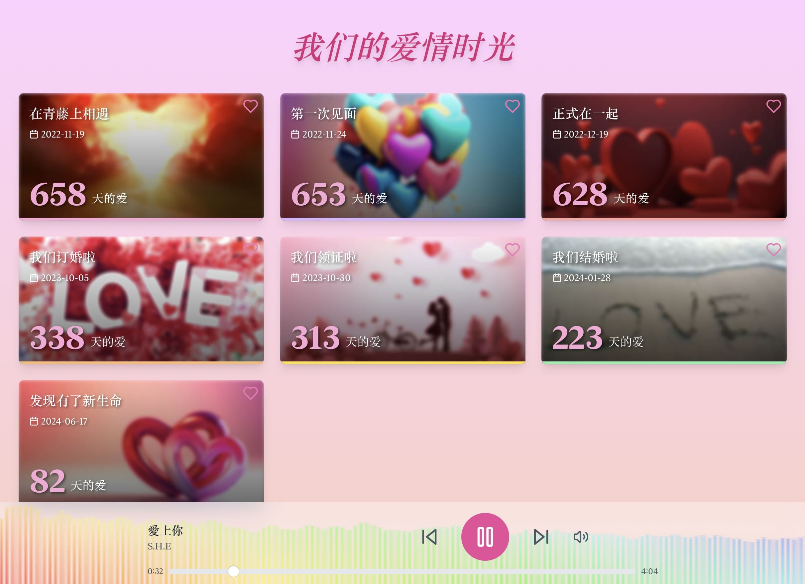

# 我们的爱情时光线

这是一个展示重要日期和纪念日的 React 应用程序。它创建了一个温馨的时间线，展示了您与伴侣之间的重要时刻，并配有背景音乐播放器。

## 在线演示

您可以在这里查看项目的在线演示：[https://love-timeline.niekun.net](https://love-timeline.niekun.net)



## 功能

- 展示重要日期的卡片，包括事件、日期和已经过去的天数
- 美化的背景和卡片设计
- 点击卡片可以查看相关图片
- 响应式设计，适应不同屏幕尺寸
- 底部固定的音乐播放器，播放浪漫的背景音乐

## 安装

1. 克隆仓库：
   ```
   git clone https://github.com/nie11kun/Love-Timeline.git
   ```

2. 进入项目目录：
   ```
   cd Love-Timeline
   ```

3. 安装依赖：
   ```
   npm install
   ```

4. 启动开发服务器：
   ```
   npm start
   ```

## 图片管理

本项目使用 `public/images` 目录来存储和管理图片。每个日期事件的图片应该放在对应的子目录中，例如：

```
public/images/
  2022-11-19/
    1.jpg
    2.jpg
  2022-11-24/
    1.jpg
  ...
```

### 注意：图片不包含在版本控制中

为了保护隐私并减少仓库大小，`public/images` 目录中的图片文件不包含在 Git 版本控制中。您需要手动管理这些图片。

## 音乐管理

背景音乐文件应放在 `public/music` 目录中。支持的音频格式包括 MP3、WAV 等。例如：

```
public/music/
  S.H.E__愛上你.m4a
  F4_-_流星雨.m4a
  Ghibli_Relaxing_Music.m4a
  ...
```

要添加或更改播放列表，请编辑 `src/playlist.js` 文件中的 `playlist` 数组：

```javascript
export const playlist = [
  { title: "愛上你", artist: "S.H.E", src: "/music/S.H.E__愛上你.m4a" },
  { title: "流星雨", artist: "F4", src: "/music/F4_-_流星雨.m4a" },
  { title: "Ghibli Relaxing Music", artist: "スターバック", src: "/music/Ghibli_Relaxing_Music.m4a" },
  // 添加更多歌曲...
];
```

## 添加新的日期事件

要添加新的日期事件，请编辑 `src/importantDates.js` 文件中的 `importantDates` 数组：

```javascript
export const importantDates = [
  { date: '2022-11-19', event: '在青藤上相遇', image: '/images/2022-11-19/1.jpg' },
  { date: '2022-11-24', event: '第一次见面', image: '/images/2022-11-24/1.jpg' },
  // 添加新的日期事件...
];
```

确保为新事件添加相应的图片到 `public/images` 目录。

## 自定义样式

- 背景样式可以在 `src/components/DaysSinceDates.js` 文件中的 `bg-love-pattern` 类中修改。
- 卡片样式可以在同一文件中的相应 JSX 部分进行调整。
- 音乐播放器样式可以在 `src/components/MusicPlayer.js` 文件中修改。

## 部署

1. 构建生产版本：
   ```
   npm run build
   ```

2. 将 `build` 目录部署到您的网络服务器。

3. 确保将 `public/images` 和 `public/music` 目录中的文件复制到生产环境的相应位置。

## 注意事项

- 请确保您有权使用所有图片和音乐文件，并遵守相关的版权法。
- 定期备份 `public/images` 和 `public/music` 目录，因为这些文件不在版本控制中。

## 贡献

欢迎提出改进建议和 pull requests。对于重大更改，请先开 issue 讨论您想要改变的内容。